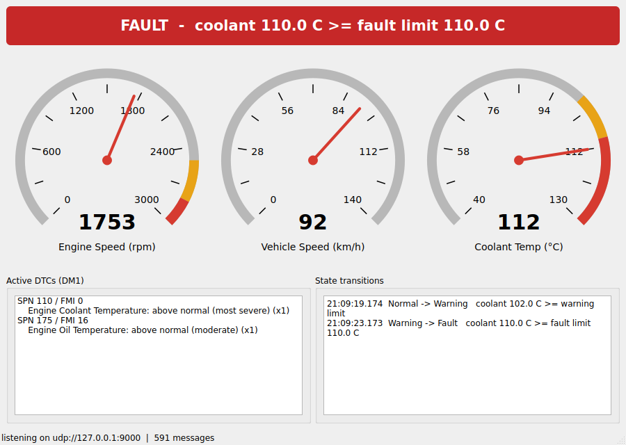
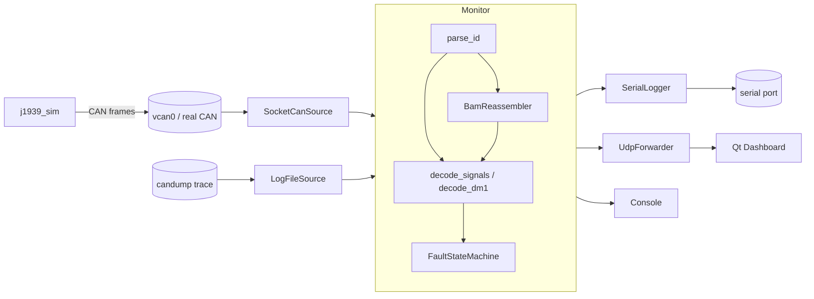
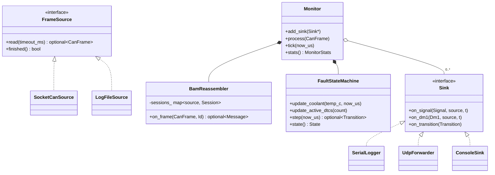
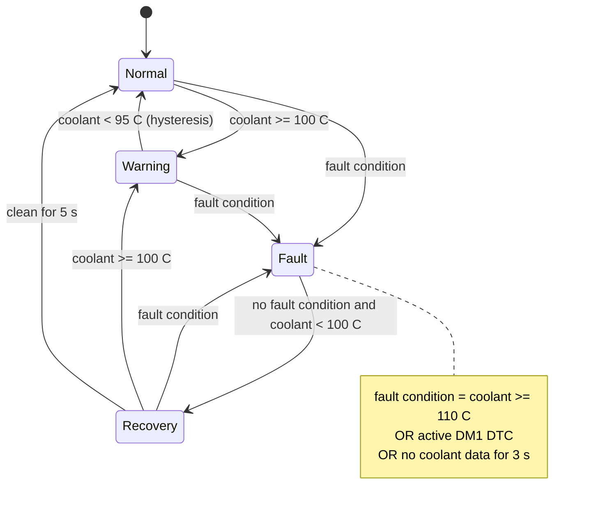

# J1939 Vehicle Bus Monitor

A C++17 tool for Linux that listens to a heavy-vehicle CAN bus, decodes SAE J1939 traffic, and tracks engine health with an explicit fault state machine. It publishes results in three ways: a serial log, UDP messages, and a Qt desktop dashboard.

It runs without any hardware: a bundled simulator generates realistic engine traffic onto a virtual SocketCAN interface (`vcan0`).



## What it does

| Area | Details |
|---|---|
| **CAN input** | Linux SocketCAN (`CAN_RAW`, kernel filter for 29-bit frames) or replay of `candump -L` traces |
| **J1939 decoding** | 29-bit ID parsing (priority, PGN, source/destination, PDU1 vs PDU2); SPN decoding with J1939 scaling and offsets; error / not-available values rejected |
| **Parameters** | Engine speed (SPN 190), torque (513), coolant temp (110), oil temp (175), vehicle speed (84) from EEC1, ET1, CCVS1 |
| **Diagnostics** | DM1 active trouble codes (19-bit SPN, FMI, occurrence count, lamp status) |
| **Transport protocol** | J1939-21 BAM reassembly for messages longer than 8 bytes; checks sequence numbers, validates size and packet count, and enforces the T1 (750 ms) timeout |
| **State machine** | Normal / Warning / Fault / Recovery, with hysteresis, a recovery hold period, and stale-data (lost ECU) detection |
| **Serial** | CSV log lines at 115200 8N1 using `termios`; non-blocking, so a slow port never stalls decoding |
| **UDP** | JSON events, fire-and-forget, for the dashboard |
| **Qt dashboard** | Custom-painted gauges with warning/fault bands, a state banner, a DTC list, and a transition log |
| **Testing** | 41 GoogleTest unit and end-to-end tests, including 5 simulated J1939 traces replayed through the full pipeline |

## Architecture



### Class diagram (UML)



### State diagram (UML)



PlantUML sources for both diagrams are in `docs/`.

## Build

These instructions are for Ubuntu 22.04/24.04. Also install `socat` and `can-utils` for the live demo.

```bash
sudo apt install build-essential cmake libgtest-dev qt6-base-dev socat can-utils
cmake -S . -B build
cmake --build build -j
ctest --test-dir build --output-on-failure
```

The Qt dashboard is optional. If Qt 6 isn't installed, CMake skips it.

**macOS / Windows (Docker):** builds, tests, and replay mode work in a container (live `vcan` needs a Linux host):

```bash
docker build -t j1939 .
docker run -it --rm -v "$PWD":/work j1939 bash
```

## Run

**Live demo** (vcan0, virtual serial port, simulator, monitor, dashboard):

```bash
scripts/run_demo.sh
```

**Piece by piece:**

```bash
scripts/setup_vcan.sh                                   # create vcan0
build/j1939_dashboard &                                 # listens on UDP 9000
build/j1939_monitor --iface vcan0 --udp 127.0.0.1:9000 --serial /tmp/ttyMON
build/j1939_sim --iface vcan0                           # in another terminal
candump -L vcan0                                        # optional: watch raw frames
```

**Without vcan** (e.g. WSL or a container): replay a trace instead.

```bash
build/j1939_monitor --replay tests/data/full_cycle.log --realtime --udp 127.0.0.1:9000
```

### Simulated drive cycle (55 s)

| Time | Event | Expected state |
|---|---|---|
| 0–10 s | engine start, rpm ramps to ~1800 | Normal |
| ~23 s | coolant reaches 100 °C | **Warning** |
| ~28 s | coolant 110 °C, ECU raises 2 DTCs (sent via BAM) | **Fault** |
| ~36 s | coolant back under 100 °C, DTCs cleared | **Recovery** |
| ~41 s | 5 s clean | **Normal** |
| 44–48 s | ET1 stops (simulated lost ECU link) | **Fault** (stale data) |
| ~48 s / ~53 s | data resumes / 5 s clean | **Recovery** / **Normal** |

## Benchmark

```bash
scripts/benchmark.sh 200000
```

This floods `vcan0` with EEC1 frames. The monitor then reports:
- throughput in frames/s
- per-frame latency (p50 / p99 / max), measured from the frame reaching user space until every sink has been written

The benchmark is only valid if the reported `frames` count equals the number sent. A lower count means the kernel socket buffer overflowed, so the rate exceeded capacity.

### Measured results

Replay benchmark (186,009-frame simulated trace, as fast as possible, serial logging on), Apple M2 in Docker:

| Metric | Result |
|---|---|
| Throughput | 400,000+ frames/s (lowest of 4 runs) |
| Per-frame latency | p50 1 µs, p99 5 µs |

For context, a fully loaded 250 kbit/s J1939 bus carries about 1,850 frames/s. Live SocketCAN benchmarking needs a Linux host with the `vcan` module; Docker Desktop's kernel does not include it.

## Serial log format

```
SIG,<t_ms>,<source>,<spn>,<value>,<unit>
DM1,<t_ms>,<source>,<lamp>,<count>,<spn>:<fmi>;...
STATE,<t_ms>,<from>,<to>,<reason>
```

## Tests

| Suite | Covers |
|---|---|
| `Id` | PDU1/PDU2 parsing, data page bit, round-trip encoding |
| `Decoder` / `Dm1` | scaling and offsets, error/not-available rejection, boundary raw values, short payloads, 19-bit SPNs |
| `Bam` | reassembly, out-of-order abort, T1 timeout, per-source sessions, invalid announce, RTS/CTS ignored |
| `Fsm` | every transition, hysteresis, recovery hold, relapse, stale data |
| `Traces` | 5 simulated traces replayed end to end (normal, overheat, comms loss, corrupt BAM, full cycle) |

## Limitations and next steps

- **RTS/CTS transport:** only BAM is handled. RTS/CTS needs the monitor to answer on the bus, and this is a passive listener.
- **Fault source:** state is driven by a single engine ECU's coolant data and DM1. Tracking faults per source address would be the next step.
- **Serial settings:** the port's baud rate is fixed at 115200.
- **Kernel timestamps:** `SO_TIMESTAMP` receive timestamps would allow bus-to-output latency instead of user-space latency.
- **Live bus testing:** validated so far with trace replay; the SocketCAN path has not yet been run against a live `vcan` or hardware interface.
